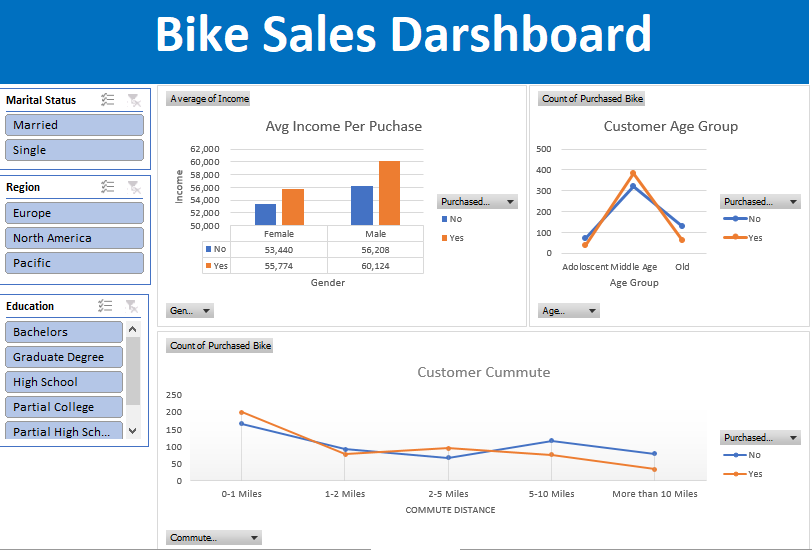
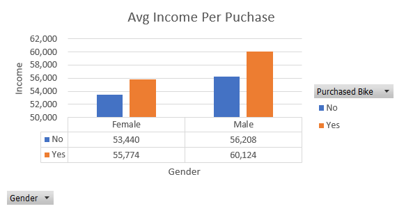
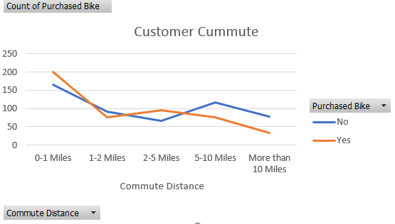
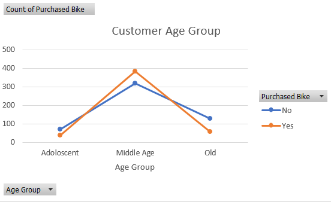

# 🚴 Bike Purchase Analysis - Excel Data Analytics Project

## 📌 Project Overview
This project analyzes a Bike Sales Dataset (sourced from Kaggle) to understand customer purchasing behavior based on demographics and commute distance. The analysis was conducted using Excel, leveraging Pivot Tables and Charts for visualization.

## 🔍 Key Questions Explored:
- Does gender influence bike purchases?
- How does commute distance affect bike purchases?
- Which age group purchases bikes the most?

## 📊 Analysis & Insights

### 1️⃣ Gender vs. Bike Purchase (Average Income Analysis)
**Pivot Table Setup:**
- **Rows:** Gender (Male/Female)
- **Columns:** Purchased Bike (Yes/No)
- **Values:** Average Income

**Key Insight:**
"Do individuals with higher average income purchase bikes more frequently?"

**Visualization:** Bar/Column Chart  

---

### 2️⃣ Commute Distance vs. Bike Purchase (Count Analysis)
**Pivot Table Setup:**
- **Rows:** Commute Distance (e.g., 0-1 miles, 1-2 miles, etc.)
- **Columns:** Purchased Bike (Yes/No)
- **Values:** Count of Purchases

**Key Insight:**
"Does a longer commute distance correlate with higher bike purchases?"

**Visualization:** Line Chart  

---

### 3️⃣ Age Group vs. Bike Purchase (Count Analysis)
**Added Column:** "Age Group" (Adolescent, Middle Age, Old)

**Pivot Table Setup:**
- **Rows:** Age Group
- **Columns:** Purchased Bike (Yes/No)
- **Values:** Count of Purchases

**Key Insight:**
"Which age group is most likely to buy bikes?"

**Visualization:** Line Chart  

## 🛠️ Tools & Techniques Used
- **Excel Functions:** Pivot Tables, Data Cleaning, Conditional Formatting
- **Data Visualization:** Bar Charts, Line Charts, Column Charts
- **Custom Column Creation:** "Age Group" categorization

## 📂 Repository Files
- `Bike_Sales_Analysis.xlsx` (contains all analysis)
  - Original Data sheet
  - Working Sheet
  - Pivot Tables sheet
  - Dashboard sheet
- `README.md` (this documentation)
- `images/` (all visualization exports)
  - `dashboard.png`
  - `gender_chart.png`
  - `commute_chart.png`
  - `age_chart.png`

## 🚀 How to Use
1. Open `Bike_Sales_Analysis.xlsx`
2. Navigate between sheets using bottom tabs
3. Use slicers in Dashboard sheet to filter data
4. View raw data in Original Data sheet
5. See calculations in Working Sheet

## 📈 Key Takeaways
 ✅ **Gender Analysis:** Males with higher average income tend to buy more bikes.
 ✅ **Commute Distance:** Customers with 0-1 mile commutes purchase bikes most frequently. 
 ✅ **Age Group Trends:** Middle-aged individuals are the primary buyers.  

## 📬 Connect With Me
🔗 LinkedIn: [https://www.linkedin.com/in/noebejara-letso-ala-9b9340351/]  
📧 Email: [noebejaraletsoala@gmail.com]  

## 🎯 Conclusion
This project demonstrates basic-to-intermediate Excel skills for data analytics, focusing on Pivot Tables, Charts, and Data Summarization. 

⭐ Feel free to suggest improvements!
